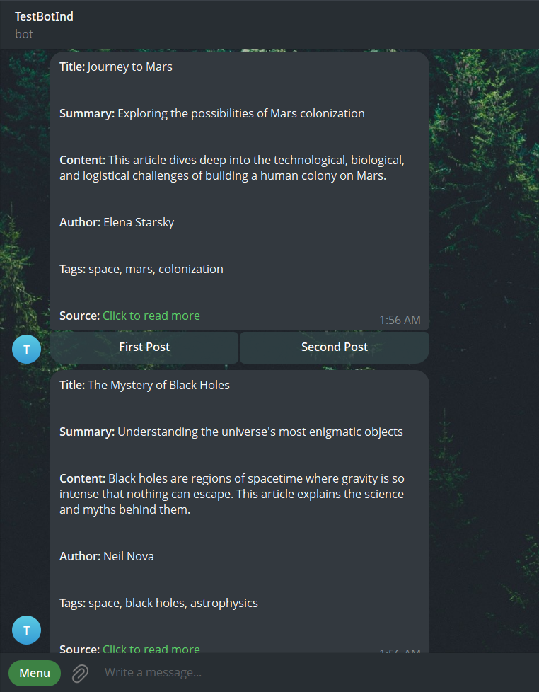
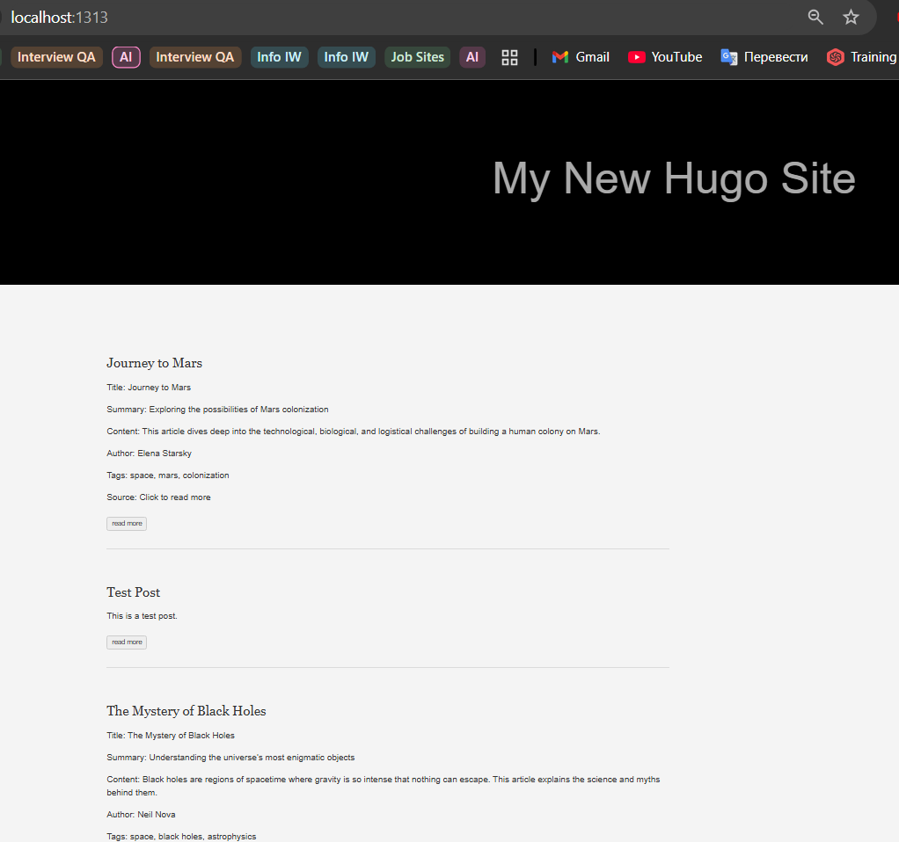

# Telegram-to-Hugo Static Site Generator
Develop Telegram bot, add integration with Hugo to generate static pages based on input data.
1. Telegram bot can create a post.
2. This post will be converted to a markdown file.
3. This markdown file will be added to the Hugo.


1. For using this project, you need to start the tg-bot (or use your own tg bot). 
You can do it using the 'docker-compose up' command to start this container.
> [!IMPORTANT]
> Please find your bot token and use it in the second module of app. 
> You should input in console (in current implementation)
> it can be changed... <br>After it your <b>Telegram Client</b> will be able to read the messages from bot.
2. Only after Hugo container will be started, you can try to get converted posts from 
telegram and turn them in md format that will be added into this directory: `hugo-site/content/`.
___

This instruction can be needed if someone want to add hugo inside implementation yourself:
> [!NOTE]
> Please note that I have added a ready-made folder to the project, so you don't have to do these steps (only the forth step, to start the Hugo server).
1. First of all, you need to create docker image, so please use this command: 
```md 
docker build -t hugo-builder .
```
2. To start `docker-compose.yml` you should run the command (we need this command to start the hugo container with needed hierarchy, and after remove container but save the created new Hugo-site):
```md 
docker-compose run --rm hugo new site tg.post-site
```
3. After that you can add your hugo configuration and add your theme to the hugo.
> [!WARNING] 
> Do not forget add this line to `hugo.toml` => `theme = 'ananke'`
```md
cd tg.post-site
git submodule add https://github.com/theNewDynamic/gohugo-theme-ananke.git themes/ananke
```

4. After that you can start the hugo server (our app automatically add content to hugo site). Use this command:
```md
docker-compose up --build
```

## Example of work
As you can see on the pictures, we have created posts via Telegram and automatically get the static pages from Hugo about these posts.

